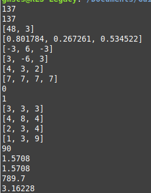
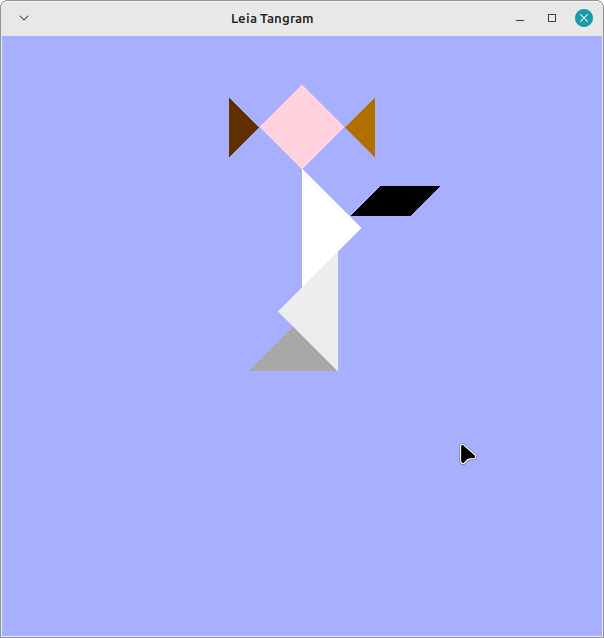
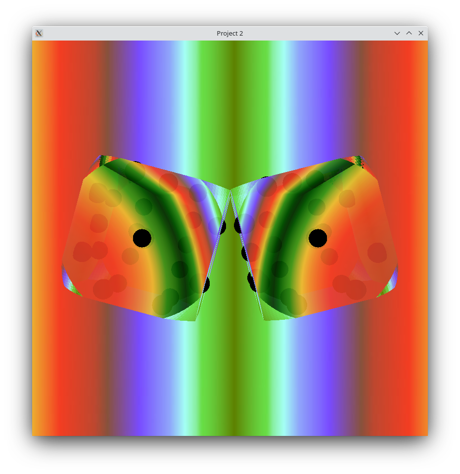
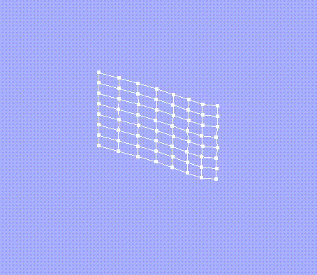

# ggl
Auxiliary libs for personal use.
Not ready for much use yet.

test.cpp:
Compile with -std=c++20 for concepts.

All examples:
Requires libglew, libglfw and opengl. 
For compilation of all examples just run make.

Output of test.cpp as of 8afab60 (15/02/2023):

Output of tangram-test.cpp as of 93acda9:

Output of the ggl branch of the OpenGL dice project as of d7d7df6:

Output of cloth.cpp as of 344fcdf:

